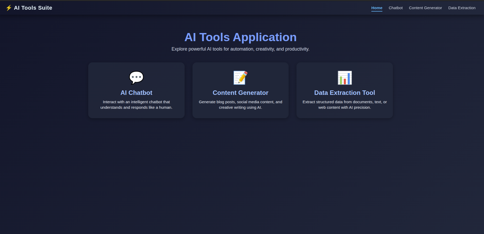
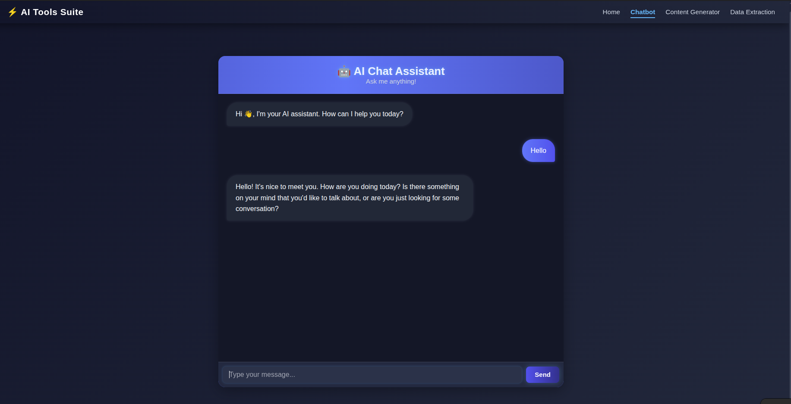
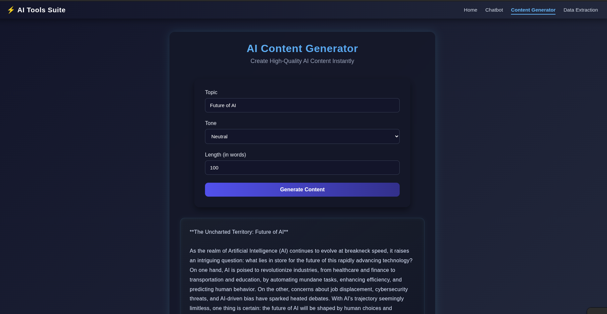
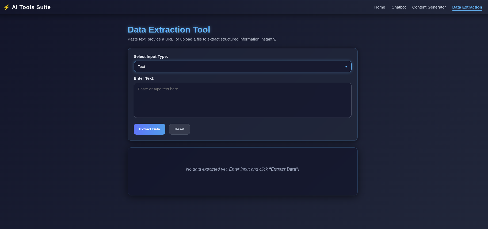

# 🚀 SmartAI-Hub

> A comprehensive AI-powered tools platform that brings chatbot, content generation, and data extraction capabilities into one unified, easy-to-use application.

[](https://fastapi.tiangolo.com/)
[](https://nextjs.org/)
[](https://www.python.org/)
[](#license)

---

## 📖 Table of Contents

- [Overview](#-overview)
- [Key Features](#-key-features)
- [Screenshots](#-screenshots)
- [Quick Start](#-quick-start)
- [Project Structure](#-project-structure)
- [Getting Started](#-getting-started)
- [Technology Stack](#-technology-stack)
- [Contributing](#-contributing)
- [License](#-license)

---

## 🎯 Overview

**SmartAI-Hub** is a feature-rich web application that consolidates three powerful AI-driven tools into a single, intuitive platform. Whether you're a student, content creator, business professional, or developer, SmartAI-Hub provides intelligent solutions for your AI-powered needs.

### Why SmartAI-Hub?

✅ **All-in-One Platform** - Eliminate tool switching. Access chatbot, content generation, and data extraction from one interface  
✅ **User-Friendly Interface** - Clean, modern design that requires no learning curve  
✅ **Production-Ready** - Built with industry-standard technologies and best practices  
✅ **Scalable Architecture** - FastAPI backend and Next.js frontend designed for growth  
✅ **Flexible AI Models** - Support for multiple AI providers (OpenAI, Groq, etc.)  

---

## ✨ Key Features

### 🤖 Intelligent Chatbot
An advanced conversational AI assistant that understands context and provides intelligent responses.

**Capabilities:**
- Natural language understanding and response generation
- Context-aware conversations
- Multiple conversation modes
- Real-time streaming responses
- Conversation history management

**Use Cases:**
- Quick Q&A assistance
- Brainstorming ideas
- Technical support
- Creative discussions

---

### ✍️ Content Generator
Transform your ideas into polished, professional content with intelligent generation capabilities.

**Capabilities:**
- Multi-format content creation (articles, posts, copies, etc.)
- Customizable tone and style
- SEO-optimized content generation
- Template-based creation
- Bulk content generation

**Use Cases:**
- Blog article writing
- Social media content creation
- Marketing copy development
- Product descriptions
- Email campaigns

---

### 📊 Data Extraction Tool
Intelligently extract, parse, and structure information from unstructured text and documents.

**Capabilities:**
- Extract structured data from raw text
- Document parsing and summarization
- Key information identification
- Multi-format document support (PDF, DOCX, TXT, etc.)
- Data export in multiple formats

**Use Cases:**
- Research paper summarization
- Invoice data extraction
- Contact information parsing
- Document classification
- Report generation

---

## 📸 Screenshots

### Dashboard & Navigation

*Main dashboard showing quick access to all AI tools*

---

### Chatbot Interface

*Intelligent chatbot conversation interface*

---

### Content Generator

*Content generation input form with customization options*

---

### Data Extraction Tool

*Data extraction form with file upload*

---

## 🚀 Quick Start

### Prerequisites

- **Node.js** v18+ (for frontend)
- **Python** 3.8+ (for backend)
- **npm** or **yarn** (Node package manager)
- **pip** (Python package manager)

### Installation

#### 1️⃣ Clone the Repository

```bash
git clone https://github.com/yourusername/SmartAI-Hub.git
cd SmartAI-Hub
```

#### 2️⃣ Backend Setup (FastAPI)

```bash
cd backend

# Create virtual environment
python3 -m venv venv

# Activate virtual environment
# On Linux/macOS:
source venv/bin/activate
# On Windows:
venv\Scripts\activate

# Install dependencies
pip install -r requirements.txt

# Configure environment variables
cp .env.example .env
# Edit .env with your API keys and configuration

# Run the backend server
python main.py
```

Backend will be available at: `http://localhost:8002`

#### 3️⃣ Frontend Setup (Next.js)

```bash
cd frontend

# Install dependencies
npm install
# or
yarn install

# Configure environment variables
cp .env.example .env.local
# Edit .env.local with your backend URL

# Run development server
npm run dev
# or
yarn dev
```

Frontend will be available at: `http://localhost:3026`

#### 4️⃣ Access the Application

Open your browser and navigate to:
```
http://localhost:3026
```

---

## 📁 Project Structure

```
SmartAI-Hub/
│
├── 📄 README.md                    # Main project documentation
├── 📄 LICENSE                      # MIT License
│
├── backend/                        # FastAPI Backend
│   ├── main.py                     # Main application entry point
│   ├── requirements.txt            # Python dependencies
│   ├── .env.example               # Environment variables template
│   └── README.md                   # Backend documentation
│
├── frontend/                       # Next.js Frontend
│   ├── package.json               # Node.js dependencies
│   ├── next.config.mjs            # Next.js configuration
│   ├── .env.example               # Environment variables template
│   ├── src/
│   │   ├── app/
│   │   │   ├── layout.jsx         # Root layout
│   │   │   ├── page.jsx           # Home page/Dashboard
│   │   │   ├── chatbot/page.jsx   # Chatbot page
│   │   │   ├── content_generator/ # Content generator page
│   │   │   └── data_extraction/   # Data extraction page
│   │   └── components/
│   │       ├── Navbar.jsx         # Navigation component
│   │       ├── ExtractorForm.jsx  # Data extraction form
│   │       ├── GeneratorForm.jsx  # Content generator form
│   │       └── ResultBox.jsx      # Results display component
│   └── README.md                   # Frontend documentation
│
└── docs/                           # Documentation assets
    └── screenshots/                # Application screenshots
```

---

## 🛠️ Getting Started

### For End Users

1. **Access the Dashboard** - Start at the home page to see available tools
2. **Choose Your Tool** - Select from Chatbot, Content Generator, or Data Extraction
3. **Provide Input** - Enter your information (text, prompts, files, etc.)
4. **Get Results** - Receive processed output instantly
5. **Export/Share** - Copy or download your results

### For Developers

**Frontend Development:**
- Framework: Next.js 14
- Styling: CSS Modules
- HTTP Client: Fetch API / Axios
- State Management: React Hooks

**Backend Development:**
- Framework: FastAPI
- AI Integration: OpenAI API / Groq
- Database: (Configurable)
- Documentation: Auto-generated with FastAPI Swagger UI

---

## 🔧 Technology Stack

### Frontend
| Technology | Purpose | Version |
|-----------|---------|---------|
| **Next.js** | React framework for production | 14.1.0 |
| **React** | UI library | 18.x |
| **CSS Modules** | Styling & design | Native |
| **pdfjs-dist** | PDF processing | 5.4.530 |
| **Mammoth** | Document conversion | 1.11.0 |
| **React Toastify** | Notifications | 11.0.5 |

### Backend
| Technology | Purpose | Version |
|-----------|---------|---------|
| **FastAPI** | Web framework | Latest |
| **Python** | Programming language | 3.8+ |
| **OpenAI API** | AI provider | Latest |
| **Groq API** | Alternative AI provider | Latest |
| **BeautifulSoup4** | HTML/XML parsing | Latest |
| **python-dotenv** | Environment management | Latest |

### Infrastructure
| Technology | Purpose |
|-----------|---------|
| **CORS** | Cross-Origin Resource Sharing |
| **REST API** | API architecture |
| **HTTP/HTTPS** | Communication protocol |

---

## 🌟 Use Cases & Examples

### 👨‍🎓 Students & Researchers
- **Chatbot**: Get instant answers to study questions
- **Content Generator**: Create research summaries and essays
- **Data Extraction**: Extract key information from academic papers

### 💼 Business Professionals
- **Chatbot**: Quick customer support and Q&A
- **Content Generator**: Create marketing materials and reports
- **Data Extraction**: Process business documents and invoices

### 📝 Content Creators
- **Chatbot**: Brainstorm creative ideas
- **Content Generator**: Generate blog posts, social media content
- **Data Extraction**: Organize research and source materials

### 👨‍💻 Developers
- **All Tools**: Test AI integration capabilities
- **APIs**: Build upon REST endpoints
- **Architecture**: Study production-ready AI application patterns

---

## 📝 Environment Configuration

### Backend (.env)

```env
# AI Provider Configuration
AI_PROVIDER=openai              # Options: openai, groq
OPENAI_API_KEY=your_api_key    # OpenAI API key
GROQ_API_KEY=your_groq_key     # Groq API key (if using Groq)
GROQ_API_URL=https://api.groq.com/openai/v1

# Frontend URL (for CORS)
FRONT_END_URL=http://localhost:3026

# Server Configuration
BACKEND_PORT=8002
DEBUG=False
```

### Frontend (.env.local)

```env
# API Configuration
NEXT_PUBLIC_BACKEND_URL=http://localhost:8002
BACK_END_URL=http://127.0.0.1:8002

# Application Configuration
NEXT_PUBLIC_APP_NAME=SmartAI-Hub
```

---

## 🔌 API Endpoints

### Chatbot API
```
POST /chat
Content-Type: application/json

{
  "message": "Your question here",
  "conversation_id": "optional_id"
}
```

### Content Generator API
```
POST /generate
Content-Type: application/json

{
  "prompt": "Content description",
  "format": "article|social|copy",
  "tone": "professional|casual|friendly"
}
```

### Data Extraction API
```
POST  /extract
Content-Type: multipart/form-data

{
  "file": "document_file",
  "extraction_type": "structured|summary|keywords"
}
```

---

## 🐛 Troubleshooting

### Common Issues

**Issue**: Backend connection refused
- **Solution**: Ensure backend server is running on the correct port (8002)

**Issue**: CORS errors
- **Solution**: Check `FRONT_END_URL` in backend `.env` matches your frontend URL

**Issue**: API key errors
- **Solution**: Verify API keys are correctly set in `.env` file

**Issue**: Node.js version mismatch
- **Solution**: Ensure Node.js v18+ is installed (`node --version`)

---

## 📚 Documentation

- **[Frontend Documentation](./frontend/README.md)** - Next.js application setup and development
- **[Backend Documentation](./backend/README.md)** - FastAPI service setup and configuration

---

## 🤝 Contributing

We welcome contributions! Here's how you can help:

1. **Fork** the repository
2. **Create** a feature branch (`git checkout -b feature/AmazingFeature`)
3. **Commit** your changes (`git commit -m 'Add some AmazingFeature'`)
4. **Push** to the branch (`git push origin feature/AmazingFeature`)
5. **Open** a Pull Request

### Contribution Guidelines
- Follow the existing code style
- Add tests for new features
- Update documentation accordingly
- Ensure all tests pass before submitting PR

---

## 📄 License

This project is licensed under the MIT License - see the [LICENSE](LICENSE) file for details.

---

## 🙋 Support & Feedback

- **Issues**: Report bugs or request features via [GitHub Issues](https://github.com/yourusername/SmartAI-Hub/issues)
- **Discussions**: Start a discussion in [GitHub Discussions](https://github.com/yourusername/SmartAI-Hub/discussions)
- **Email**: support@smartai-hub.com

---

## 👥 Creator

SmartAI-Hub is a personal project created and maintained by you

---

## 🎉 Acknowledgments

- FastAPI for the amazing web framework
- Next.js for the powerful React framework
- OpenAI & Groq for AI capabilities
- The open-source community for incredible tools and libraries

---

**Made with ❤️ by You**

*Last Updated: April 2025*
- Environment setup
- API endpoints
- AI service integration
- Database configuration

---

## 📂 Repository Branches

- **`main`** - Production-ready code and documentation
- **`combined_frontend`** - Frontend development branch
- **`combined_backend`** - Backend development branch

---

*Built with a focus on simplicity, performance, and user experience.*